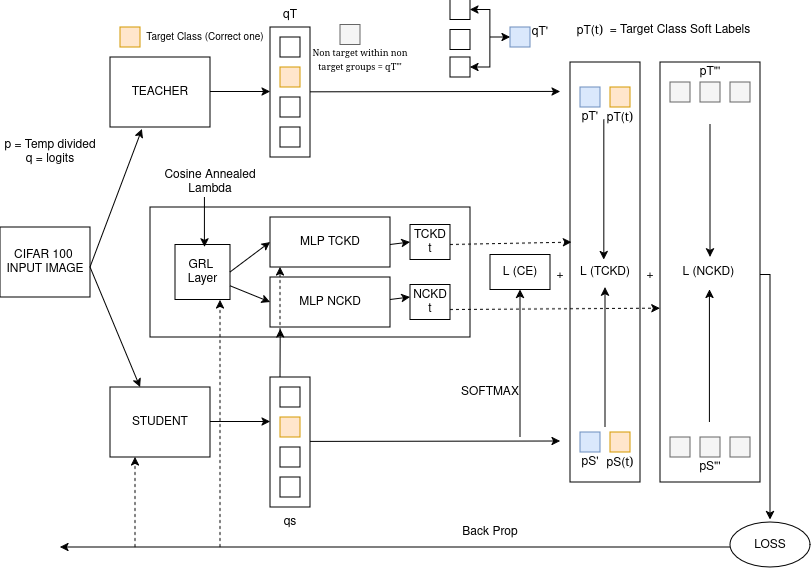
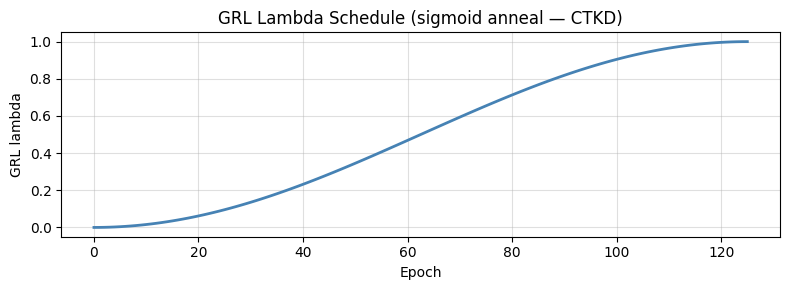
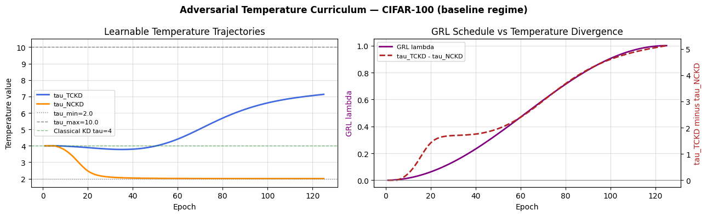
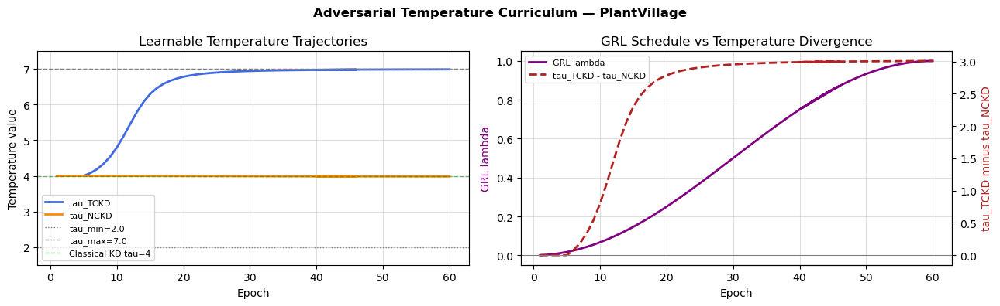

# Dynamic Temperature for Decoupled Knowledge Distillation (DT-DKD)

---

## Overview

Knowledge distillation (KD) works by transferring knowledge from a large, pretrained teacher network to a smaller student network. Instead of just learning from hard labels, the student learns from the teacher's soft output distributions.

One of the most important settings in this process is the softmax temperature τ. This value controls how smooth or sharp the output distributions are. Most existing methods keep τ constant throughout the entire training process. We believe this is not the best approach because the student's ability to learn changes over time, and different parts of the distillation loss might need different levels of smoothing.

This project introduces **DT-DKD (Dynamic Temperature Decoupled Knowledge Distillation)**. Here is how it works:

1. It uses the **Decoupled Knowledge Distillation (DKD)** framework (Zhao et al., 2022) as a foundation. This method splits the distillation loss into two parts: **Target-Class KD (TCKD)** and **Non-Target-Class KD (NCKD)**.
2. It gives each of these parts its own te mperature that the model learns on its own. These temperatures are predicted by a simple MLP that looks at the student's current outputs.
3. The temperature module is trained using an adversarial approach with a Gradient Reversal Layer (GRL). We use a cosine schedule to make the distillation harder as the student gets better at the task.

DT-DKD was tested on the **CIFAR-100** and **PlantVillage** datasets. It consistently performs better than the standard DKD and CTKD baselines without adding any significant computational cost or needing extra validation data.

### Pipeline




## Results Summary

| Method | CIFAR-100 Top-1 (%) | PlantVillage Val Top-1 (%) | PlantVillage Test Top-1 (%) |
| --- | --- | --- | --- |
| Teacher (ResNet-18) | 76.77 | 99.93 | — |
| MobileNetV2, no KD | 66.75 | 99.47 | — |
| Classical KD | 72.80 | 99.91 | 99.80 |
| DKD (fixed τ) | 72.29 | 99.87 | 99.76 |
| DKD + Dual Scalar τ | 72.85 | 99.87 | 99.78 |
| **DT-DKD (ours)** | **73.67** | **99.91** | **99.78** |

---

## Repository Structure

```
.
├── Improvement 2/                  # DT-DKD: our proposed method
│   ├── Improvement2_CIFAR100.ipynb       # Best model: CIFAR-100
│   ├── Improvement2_PlantVillage.ipynb   # Best model: PlantVillage
│   └── ablations/
│       ├── CIFAR/                  # Selected ablation notebooks for CIFAR-100
│       │   ├── ...
│       └── PlantVillage/           # Selected ablation notebooks for PlantVillage
│           ├── ...
│
├── Improvement 1/                  # DKD + CTKD
│   ├── Improvement1_CIFAR100.ipynb       
│   ├── Improvement1_PlantVillage.ipynb
│
├── baselines/                      # All baseline implementations
│   ├── ...
│
└── README.md

```

### What lives where

| Folder | Contents |
| --- | --- |
| `Improvement 2/` | The two main notebooks used to get our best DT-DKD results for each dataset. |
| `Improvement 2/ablations/CIFAR/` | Notebooks exploring different weights, temperature ranges, MLP sizes, schedules, and architectures on CIFAR-100. |
| `Improvement 2/ablations/PlantVillage/` | Similar tests for the PlantVillage dataset, including specific tuning for learning rates and loss weights. |
| `baselines/` | Implementations of benchmarks B1 to B6, including teacher-only models, standard students, and various KD methods. |

---

## Graphs





---

## Key Design Choices

**Why use two temperatures?** TCKD handles a simple binary choice (the correct class versus everything else), while NCKD handles the distribution across all other classes. These are two different tasks that need different levels of smoothing. In our tests, the model naturally learned to make τ_TCKD much higher than τ_NCKD, which shows that using two separate temperatures was the right choice.

**Why use an MLP instead of a single number?** A single fixed temperature treats every image in a batch the same way. By using an MLP that looks at the student's actual outputs, the model can adjust the temperature for every individual sample. This helps the system adapt to how difficult a specific image is or how confused the student is about certain classes.

**Why use a cosine schedule for the GRL?** Other methods often use a sigmoid schedule that gets difficult too quickly at the start and then stays flat. A cosine schedule spreads the difficulty increase more evenly across the whole training process. This change alone gave us a +0.46% boost on CIFAR-100.


---

## References

* Hinton et al. (2015) — Distilling the Knowledge in a Neural Network
* Zhao et al. (2022) — Decoupled Knowledge Distillation 
* Li et al. (2023) — Curriculum Temperature for Knowledge Distillation 
* Wei & Bai (2024) — Dynamic Temperature Knowledge Distillation
* Liu et al. (2022) — Meta Knowledge Distillation
